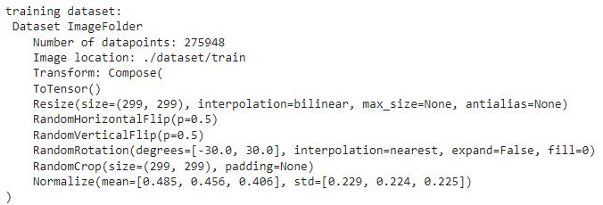
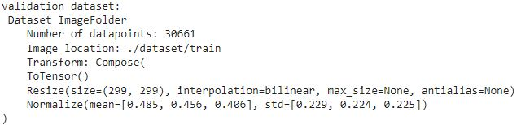
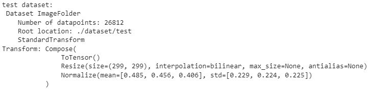
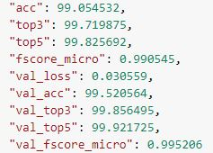

# Plant-Disease-Detector-App
A demo application of Plant disease detection model built with Streamlit library. Here's the [demo](https://adnan-plant-disease-detector.streamlitapp.com/)

### Dataset
I used [this](https://www.kaggle.com/datasets/vipoooool/new-plant-diseases-dataset) dataset from kaggle for plant images. For non plant image detection, I used a private dataset for non plant images.
See the images below for a detail description of dataset and augmentation techniques used.
1. 
2. 
3. 

### Model details
To solve this task, I have created a model that includes detection of non plant image as well as detection of excluded plants. Currently the model can detect  **citrus, tomato and potato** plant diseases and ignores other plants. In total, the model has 19 classes. The non plant images are added as **"not_plant"** and excluded plant categories as **"Other_Plants"**. The rest are healthy and different diseased plant images. For details of the class labels, see the ***static.py*** file. \n

I fine-tuned **Efficientnet V2-B2** architecture on the custom dataset. See the model metrics below

